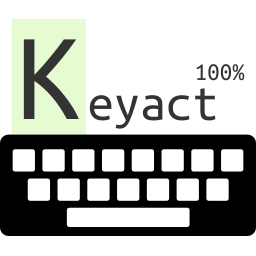

# Keyact

  

A typing trainer written in react/redux to help me learn to type in colemak-dh. Tracks your accuracy and speed (in words per minute) against lessons generated from the top 200 English words (plus a few custom ones). Also shows you a breakdown of WPM for each word after a lesson is complete.

There is nothing specific to colemak-dh in the code. It is just a fun project to play around with.

# Building
1. `git clone` the project
1. `npm install`
1. `npm run start`
